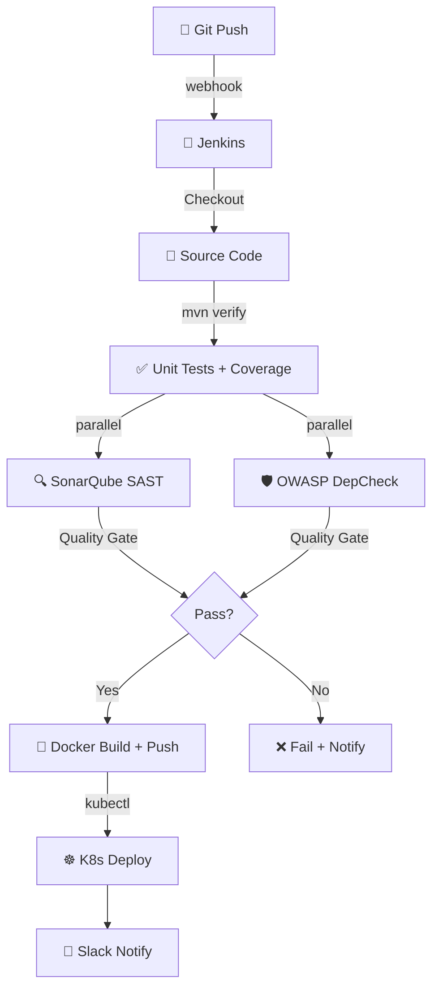

# 🏭 Jenkins CI/CD Pipeline
> **Standardize continuous integration cycles. Write automated multi-branch Jenkins pipelines with integrated static scanning triggers.**

[](https://pradeeptalari14.github.io/portfolio/tools/jenkins/)
[]()

---

## 🎛️ Studio Options — What the UI Generates

The studio has multiple configurable options. Each combination produces different output files.
This repository contains **one working example per option variant** so you can learn by diffing.

### Output Tabs (files the studio generates)
| Tab | Description |
|-----|-------------|
| `Jenkinsfile` | Generated in studio Output tab |
| `shared-library/steps` | Generated in studio Output tab |
| `Flow Diagram` | Generated in studio Output tab |

### Configurable Options
| Option | Available Values |
|--------|-----------------|
| **Build Tool** | `Maven` / `Gradle` / `npm` / `Docker-only` |
| **Agent** | `Kubernetes Pod` / `Docker` / `Linux Shell` |
| **Features** | `SonarQube SAST` / `OWASP Dependency Check` / `Trivy Image Scan` / `Slack Notifications` |
| **Deploy Target** | `Kubernetes` / `Docker Swarm` / `SSH Remote` |

---

## 🏗️ Architecture Flow Diagram



---

## 📁 Repository Structure

```
tp-jenkins/
├── README.md          ← This file — complete learning guide
├── Jenkinsfile
├── scripts/           ← Deployment + validation helpers
└── docs/USAGE.md      ← Extended usage guide
```

---

## ⚡ Quick Start

### Step 1 — Generate files from the Studio
1. Open **[Jenkins CI/CD Pipeline Studio](https://pradeeptalari14.github.io/portfolio/tools/jenkins/)**
2. Select your option values in the UI
3. Watch the output update live in the editor
4. Click **Download** or **Copy** for each tab

### Step 2 — Use the example files in this repo
```bash
git clone https://github.com/Pradeeptalari14/tp-jenkins.git
cd tp-jenkins
# Browse examples/ to find the variant matching your needs
# Copy the relevant files into your project
```

---

## 🔄 Complete Start-to-End Workflow


---

## 📖 How Each Option Changes the Output

### Build Tool
- **`Maven`** — see `examples/` folder for generated output
- **`Gradle`** — see `examples/` folder for generated output
- **`npm`** — see `examples/` folder for generated output
- **`Docker-only`** — see `examples/` folder for generated output

### Agent
- **`Kubernetes Pod`** — see `examples/` folder for generated output
- **`Docker`** — see `examples/` folder for generated output
- **`Linux Shell`** — see `examples/` folder for generated output

### Features
- **`SonarQube SAST`** — see `examples/` folder for generated output
- **`OWASP Dependency Check`** — see `examples/` folder for generated output
- **`Trivy Image Scan`** — see `examples/` folder for generated output
- **`Slack Notifications`** — see `examples/` folder for generated output

### Deploy Target
- **`Kubernetes`** — see `examples/` folder for generated output
- **`Docker Swarm`** — see `examples/` folder for generated output
- **`SSH Remote`** — see `examples/` folder for generated output

---

## 🔐 Security Best Practices

- ❌ Never commit credentials, API keys, or passwords
- ✅ Use environment variables or secret managers (Vault, AWS SSM, GitHub Secrets)
- ✅ Enable branch protection: require PR reviews + CI status checks
- ✅ Rotate credentials regularly and use least-privilege

---

## 📖 Resources

| Resource | Link |
|----------|------|
| Interactive Studio | [Open →](https://pradeeptalari14.github.io/portfolio/tools/jenkins/) |
| All 91 Studios | [Dashboard →](https://pradeeptalari14.github.io/portfolio/tools/) |
| SRE Provisioning Guide | [Handbook →](https://github.com/Pradeeptalari14/portfolio/blob/main/GITHUB_PROVISIONING_GUIDE.md) |

---
*Generated by [Jenkins CI/CD Pipeline Studio](https://pradeeptalari14.github.io/portfolio/tools/jenkins/) — [Talari Pradeep Portfolio](https://pradeeptalari14.github.io/portfolio)*